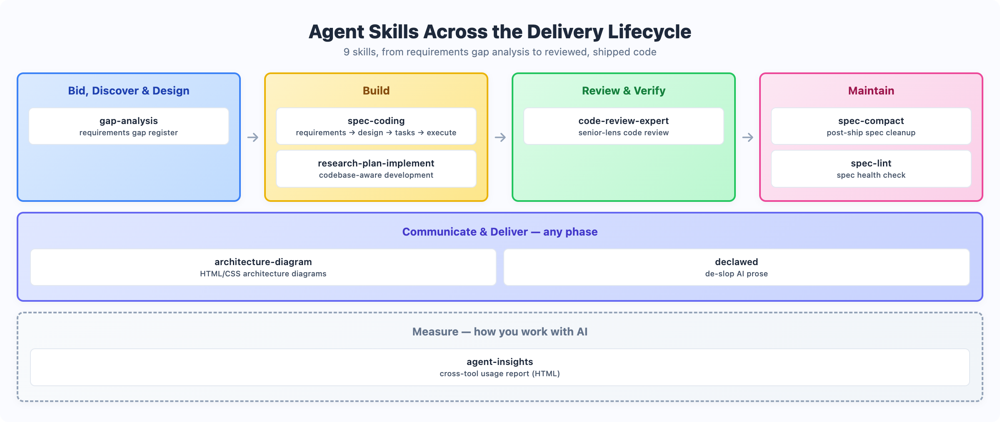

# Agent Skills

A collection of 9 agent skills for software delivery work, from requirements gap analysis to reviewed, shipped code. Each skill is a self-contained folder that teaches an AI coding agent how to do one job well: run a spec-driven build, review code like a senior engineer, diagram a system architecture, or tell you how you actually use your AI tools. They work with Claude Code/Cowork, Codex, Cursor Copilot, OpenCode, and any other agent that supports the skills format.



## Installing

### As a Claude Code plugin (all skills)

All 9 skills ship as one Claude Code plugin. Add the marketplace, then install:

```
/plugin marketplace add kevinlin/skills
/plugin install ai-sdlc-skills@ai-sdlc
```

Or from your shell:

```
claude plugin marketplace add kevinlin/skills
claude plugin install ai-sdlc-skills@ai-sdlc
```

Plugin skills are namespaced by plugin name: invoke them as `/ai-sdlc-skills:spec-coding` or `/ai-sdlc-skills:agent-insights 90`, or just describe the task. Update later with `/plugin marketplace update ai-sdlc`.

### As a single skill

1. Copy the skill folder into your agent's skills directory, for example `~/.claude/skills/`.
2. For the Claude desktop app, zip the skill folder and drop the zip into the app.
3. Invoke it with its slash command (`/spec-coding`, `/agent-insights 90`, ...), or just describe the task; skills trigger on matching requests.

## Bid, Discover & Design

### [gap-analysis](gap-analysis/)

Compares requirement documents (BPMN models, feature specs, RFP text) and produces a shareable HTML gap register: severity-tagged gaps with workstream and owner pills, plus a master roll-up index across all reports. Built for the situation where you need to put a structured "here is what the requirements miss" report in front of a client, and free-form Markdown won't cut it.

## Build

### [spec-coding](spec-coding/)

Spec-driven development in five stages: confirm the goal, write EARS-format requirements, produce a design document, plan the tasks, then execute them one at a time. A human approval gate sits between each stage, so the agent never runs ahead of you. Specs land in `docs/specs/{feature-name}/` and become the input that spec-lint and spec-compact maintain later.

### [research-plan-implement](research-plan-implement/)

For work where understanding the codebase first prevents expensive rework: multi-file features, root-cause bug hunts, refactoring with architectural implications. The skill spawns six specialized sub-agents in parallel to research the code, iterates on a plan with you, then implements phase by phase with verification. Along the way it practices Frequent Intentional Compaction: findings and plans go into markdown documents that carry context across sessions instead of bloating the conversation.

## Review & Verify

### [code-review-expert](code-review-expert/)

Code review with a senior engineer's lens: architecture, SOLID principles, security, performance, error handling, testing gaps, and API contract changes. The checklists live in `references/`, so the review is repeatable rather than dependent on whatever the model feels like checking today. Works with any language and any size of change.

## Maintain

### [spec-compact](spec-compact/)

The post-implementation cleanup. During implementation a plan needs detail: code snippets, exact file edits, test commands, step-by-step tasks. After shipping, most of that becomes noise the codebase now owns. spec-compact strips the transient detail and keeps the durable parts: context, design decisions, task intent, critical file references, follow-ups, and the changelog. Together with spec-lint, the spec-driven workflow becomes requirements, design, implement, compact, lint.

### [spec-lint](spec-lint/)

Specs rot. A plan ships but keeps its old steps; a design decision changes during delivery but the doc stays the same; references point at files that moved; TODOs outlive the work. Agents treat visible specs as ground truth, so a wrong spec makes them start from the wrong reality and produce confidently wrong changes. spec-lint health-checks your spec docs: orphan specs, dead links, broken index tables, naming drift, empty sections, stale TODOs, and above all reverse consistency — does the design still cover the requirements, and does the plan still cover the design? It auto-detects your layout and supports Kiro, OpenSpec, GitHub spec-kit, Superpowers, BMad, GSD, and a generic `docs/specs/` structure.

## Communicate & Deliver

### [architecture-diagram](architecture-diagram/)

Generates layered system architecture diagrams as pure HTML/CSS: color-coded tiers, grid layouts, and sidebars for cross-cutting concerns like security and monitoring. Ships 12 visual styles and 12 layout patterns that combine freely, covering technology stacks, microservice topologies, pipelines, and before/after comparisons. The lifecycle diagram at the top of this README is one of its outputs.

### [declawed](declawed/)

A de-slop pass for any text. It detects the statistical fingerprints of AI writing (negative parallelism, puffery, rule-of-three padding, false ranges, hedged both-sidesing, em-dash abuse, uniform cadence) and rewrites the text to fit its target register. Then it re-scans its own rewrite, because rewrites reintroduce slop, and loops until the scan comes back clean. Inspired by JuliusBrussee's fuck-slop skill; renamed here because typing that slash command in front of clients got old fast. The first replacement name, "declaude", hit a reserved word in the Claude app, so the skill follows the OpenClaw naming school instead.

## Measure

### [agent-insights](agent-insights/)

Started with a client question at a meetup: how do you track actual AI tooling usage across an organisation? The skill scans locally stored session logs from Claude Code, Claude Cowork, GitHub Copilot (VS Code, CLI, JetBrains), Cursor, Codex, Kiro, Antigravity, and OpenCode, analyses the last N days (default 30), and generates a human-readable HTML report plus an at-a-glance summary in chat. Everything runs locally; the skill sends neither your session logs nor the report anywhere.

## Versioning

Each skill declares a `version` in its SKILL.md frontmatter, and [versions.json](versions.json) lists the latest version of every skill. To check whether your installed copy is current, compare its `version` field against the entry there.

## Skill anatomy

Every skill follows the same shape:

- `SKILL.md` — the skill definition the agent loads
- `README.md` — human documentation, where present
- `references/` — checklists, catalogues, and guides the skill loads on demand
- `agents/` — sub-agent definitions, for skills that fan out work
- `scripts/` — helper scripts the skill runs instead of improvising
