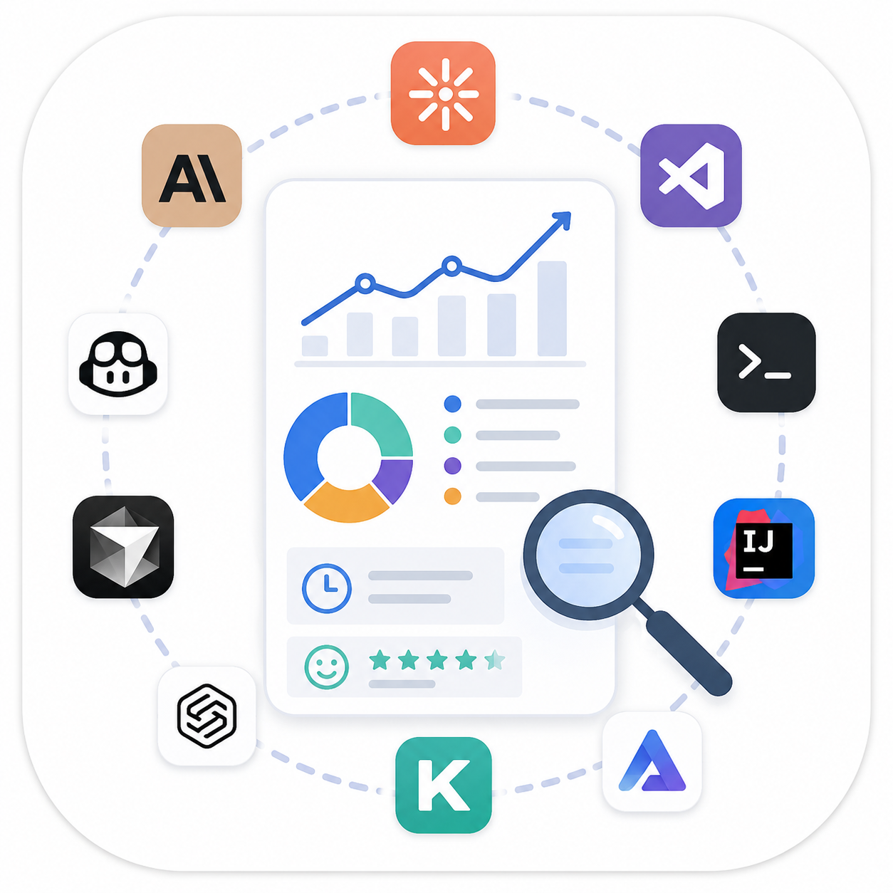

# agent-insights

<p align="center">
  
</p>

A cross-tool version of Claude Code's builtin `/insights` command, packaged as an agent
skill. Scans locally stored AI coding agent sessions from the last N days, analyzes how
you work with your agents, and produces a self-contained HTML report plus an
"At a Glance" summary in chat.

## Supported tools

Claude Code, Claude Cowork (desktop local agent mode), GitHub Copilot (VS Code chat +
CLI + JetBrains IDEs), Cursor, Codex, Kiro, Antigravity (Gemini IDE), OpenCode. Where the
logs expose it, the model used per session is captured too.

All sources are treated the same: if session logs exist they are processed; absent
sources are skipped silently. The skill only errors when zero sessions are found across
every source.

## Usage

```
/agent-insights          # last 30 days
/agent-insights 7        # last 7 days
/agent-insights 90       # last 90 days (clamped to 1..365)
```

## How it works

0. **Detect runtime** (`scripts/agent_insights.py detect`): checks whether the skill is
   running on the host or inside a sandboxed runtime (e.g. Claude Cowork) whose container
   does not mount the host filesystem. If sandboxed, the host's agent logs aren't
   reachable, so the skill explains this and points you at a non-sandboxed agent instead
   of generating an empty report.
1. **Scan** (`scripts/agent_insights.py scan`): Python 3 stdlib-only script discovers and
   parses session logs per tool (JSONL, JSON, SQLite), normalizes them into common
   per-session metadata + truncated transcripts, filters out trivial sessions, and caches
   results in `~/.agent-insights/cache/`.
2. **Facet extraction**: parallel subagents (one per batch of ~10 sessions, max 50
   sessions per scan round) extract subjective facets per session: goal, outcome,
   satisfaction, friction, session type, user expertise. If more than 50 sessions need facets, the scan
   reports the rest as deferred and the pipeline loops scan -> extract -> aggregate
   until the window is covered. On agents without subagent support (e.g. OpenCode) the
   main agent processes the batches sequentially instead. Facets are cached, so re-runs
   only pay for new sessions.
3. **Aggregate** (`aggregate`): merges metadata + facets into totals, distributions
   (goals, outcomes, satisfaction, friction, user expertise, models, skills used) and a
   per-tool breakdown (incl. skill invocations). Skill invocations are counted
   deterministically at scan time (no facets): the `Skill` tool in Claude Code / Cowork
   logs, plus leading `/name` slash commands in Cursor and OpenCode user messages (where
   skills run as slash commands); names merge across tools. Records `analysis_model` —
   the model of the main agent running the skill
   (passed via `--analysis-model`), so reports generated by different models can be
   benchmarked against an agreed standard. Also stamps the skill `version` (read from
   `SKILL.md` frontmatter at runtime) into the output, so every artifact is traceable to
   the release that produced it.
4. **Narrative**: the main agent writes report sections (At a Glance, Tool Comparison,
   Project Areas, Interaction Style, What Works, Friction, Suggestions, New Use Cases
   to Try, Fun Ending) grounded in the aggregate data.
5. **Render** (`render`): self-contained HTML report at
   `~/.agent-insights/report-YYYY-MM-DD_<days>-days.html` (mode 0600), where `<days>`
   is the analyzed window (default 30). Contains the narrative sections, a per-tool
   breakdown, and the Stats charts (Goals, Outcomes, Model Uses, Skills used, Agent tools
   used, User Expertise). When any skill invocations are present, a "skill invocations"
   hero stat, a per-tool "Skill invocations" chart, and the "Skills used" Stats chart
   appear; they're hidden for runs with no skill usage. Charts use a fixed metric-to-hue
   palette (the dataviz validated 8-hue categorical set + a status red for friction): each
   metric keeps one colour report-wide — skills and tools match across the Per-Tool and
   Stats sections — and no two charts within a section repeat a colour. The header shows
   the analysis model and the skill version.

## Privacy

Everything runs locally. The script makes no network calls. Transcript snippets only
appear in the local report file and the local cache.

## Layout

```
agent-insights/
├── SKILL.md                  # skill definition (pipeline orchestration)
├── scripts/agent_insights.py # detect / scan / aggregate / render (Python 3 stdlib only)
├── references/
│   ├── prompts.md            # facet-extraction + narrative-section prompts
│   ├── data-sources.md       # per-tool storage locations, formats, parsing notes
│   ├── goal-classifier-prompt.md      # 9-work-mode goal taxonomy (Anthropic research)
│   ├── session-outcome-prompt.md      # 4-label outcome rubric (Anthropic research)
│   └── expertise-classifier-prompt.md # 5-level user-expertise scale (Anthropic research)
├── evals/evals.json          # skill-triggering + fixture-pipeline eval cases
└── tests/
    └── make_fixtures.py      # generates synthetic session files per tool format
```

Subcommands accept `--data-dir` to relocate intermediate files (`~/.agent-insights/` by
default); `detect`/`scan` accept `--home` to point at a fixture home for tests.

## Design

Spec: `docs/design_agent-insights.md` (repo root). Modeled on the `/insights` pipeline.
