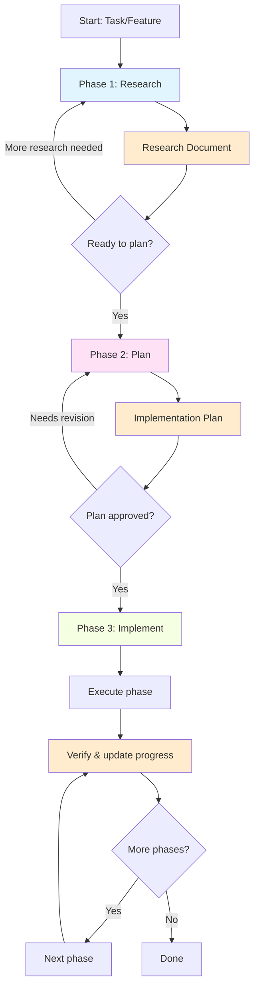

# Research → Plan → Implement Workflow

A structured three-phase approach for complex tasks. Instead of diving straight into code (which works fine for simple changes), this workflow front-loads understanding so that implementation goes smoothly the first time. Each phase produces a compact artifact that carries forward, keeping context clean as work progresses.

## When to use this skill

This skill earns its overhead when the task has **uncertainty** — you don't fully understand the codebase area, the right approach isn't obvious, or mistakes would be costly to undo:

- **Complex features** — New functionality touching multiple files and components
- **Bug investigation** — Issues where the root cause isn't obvious and needs tracing
- **Architectural refactoring** — Changes with ripple effects across the codebase
- **Unfamiliar codebases** — When you need to build understanding before acting

**Skip this skill for**: Simple fixes, typos, single-file changes, or tasks where the path forward is already clear.

## Workflow overview



## Core ideas

- **TodoWrite** tracks progress throughout the workflow
- **Compaction points** between phases keep context windows clean — each phase produces a document that carries the essential knowledge forward
- **Human review at phase boundaries** is where you get the most leverage: catching a bad research conclusion or flawed plan is far cheaper than catching bad code
- **Phases are iterative** — you can always loop back when implementation reveals new insights

---

## Initial interaction

When invoked, greet the user and orient them:

```
# Research → Plan → Implement

I'll guide you through a structured workflow:

**Phase 1: Research** — Understand the codebase and document findings
**Phase 2: Plan** — Design a phased implementation approach
**Phase 3: Implement** — Execute with verification at each step

Each phase produces a document that carries context forward cleanly.

---

**Let's start with Phase 1: Research**

Please share:
- Your task, feature request, or bug description
- Any relevant files, tickets, or documentation
- Context about what you're trying to accomplish
```

Wait for the user's response before proceeding.

---

## Phase 1: Research

**Goal**: Understand the codebase area relevant to the task and produce a structured research document with specific file references.

**Output**: A markdown research document (saved to the project's preferred docs location, or a sensible default like `docs/research/` or the project root).

### Process

1. **Read user-mentioned files first** — If the user points to specific files, read them fully before doing anything else. This gives you the context needed to ask the right questions of the codebase.

2. **Decompose the research question** — Break the task into distinct areas to investigate. Create a TodoWrite list to track research subtasks.

3. **Investigate the codebase** — Use sub-agents scaled to the task's complexity (see [Adaptive Sub-Agent Usage](#adaptive-sub-agent-usage) below). The goal is to document what exists — describe how things work without critiquing or suggesting improvements.

4. **Synthesize findings** — Wait for all sub-agents to complete, then compile results. Prioritize what you found in the live codebase. Include specific `file:line` references for all significant findings.

5. **Generate research document** — Run `./scripts/spec_metadata.sh` to collect git/date metadata, then write a structured document with: research question, summary, detailed findings, code references, and open questions.

6. **Present findings** — Share a concise summary with the user, highlighting key discoveries.

### Phase transition

```
**Phase 1 Complete: Research Document Created**

I've documented findings in `[path to document]`

**Key findings:**
- [2-3 bullet summary]

Ready to create an implementation plan? Type "plan" to proceed, or ask for more research.
```

**For the full research process, see [references/phase1-research-guide.md](references/phase1-research-guide.md)**

---

## Phase 2: Plan

**Goal**: Transform research into an actionable implementation plan with clear phases, specific file changes, and testable success criteria.

**Output**: A markdown implementation plan with numbered phases and separated automated/manual verification criteria.

### Process

1. **Build on research** — Load the Phase 1 document. If the user corrects anything, verify the correction in the codebase before proceeding.

2. **Design interactively** — Present design options with pros/cons. Get feedback on approach before writing details. The planning phase is a conversation, not a monologue.

3. **Write the plan** — Document phases with specific file changes. Separate success criteria into **automated** (commands that can be run) and **manual** (things requiring human judgment). Resolve all open questions — a plan with unknowns isn't ready.

4. **Iterate until approved** — Present the draft, incorporate feedback, repeat until the user is satisfied.

### Phase transition

```
**Phase 2 Complete: Implementation Plan Created**

Plan is at `[path to document]`

**Summary:**
- [N] phases with specific file changes
- Automated and manual success criteria for each phase

Ready to implement? Type "implement" to proceed, or suggest plan adjustments.
```

**For the full planning process, see [references/phase2-planning-guide.md](references/phase2-planning-guide.md)**

---

## Phase 3: Implement

**Goal**: Execute the plan phase-by-phase with verification after each phase.

**Output**: Working implementation with all automated checks passing.

### Process

1. **Load complete context** — Read the plan and research document fully. Check for existing checkmarks to see what's already done.

2. **Execute one phase at a time** — Make changes, run automated verification, fix failures. Update checkboxes in the plan as items pass.

3. **Pause for manual verification** — After automated checks pass, stop and list the manual verification steps for the user. Wait for confirmation before proceeding (unless the user asked you to do multiple phases).

4. **Handle mismatches** — If reality doesn't match the plan, stop and explain: what the plan expected, what you found, why it matters, and options for how to proceed. Don't improvise without approval.

5. **Manage context** — For plans with 4+ phases, compact progress after each phase by adding implementation notes to the plan file.

### After completion

```
**Implementation Complete**

All phases implemented and verified:
- All automated verification passing
- Implementation matches the plan

**Changes made:**
- [Brief summary]

**Next steps:**
- Perform final manual testing
- Review changes
- Create commit/PR when satisfied
```

**For the full implementation process, see [references/phase3-implementation-guide.md](references/phase3-implementation-guide.md)**

---

## Adaptive sub-agent usage

Not every task needs the same level of investigation. Scale your sub-agent usage to match the task's complexity:

### Light investigation (1-2 agents)

For tasks where the affected area is small or mostly known:
- A single **codebase-locator** to find relevant files, then read them yourself
- Or a **codebase-analyzer** on a specific component you've already located

### Standard investigation (2-4 agents in parallel)

For most tasks — run agents concurrently on different aspects:
- **codebase-locator** to find where things live
- **codebase-analyzer** to understand how specific code works
- **codebase-pattern-finder** to find similar existing patterns to model after

### Deep investigation (4-6 agents in parallel)

For large, unfamiliar, or high-stakes tasks:
- All the standard agents, plus:
- **web-search-researcher** when external docs or API references are needed
- Multiple analyzer agents targeting different subsystems

### Choosing the right level

Ask yourself: *How much do I already know about the relevant code?* If the user pointed you to specific files and the change is localized, light investigation is enough. If you're exploring unfamiliar territory across multiple subsystems, go deep.

### Available agents

All agents are in the `agents/` directory. Each knows its job — just tell it what you're looking for:

| Agent | What it does | Tools |
|---|---|---|
| **codebase-locator** | Finds WHERE files and components live | Grep, Glob, LS |
| **codebase-analyzer** | Understands HOW specific code works | Read, Grep, Glob, LS |
| **codebase-pattern-finder** | Finds similar patterns to model after | Grep, Glob, Read, LS |
| **thoughts-locator** | Discovers relevant docs in thoughts/ directory | Grep, Glob, LS |
| **thoughts-analyzer** | Extracts insights from specific documents | Read, Grep, Glob, LS |
| **web-search-researcher** | Finds external docs and resources | WebSearch, WebFetch, Read |

All agents are documentarians — they describe what exists without suggesting changes. This keeps their output focused and useful as reference material.

---

## Why this workflow is structured this way

### Front-loading understanding prevents rework

The cost of mistakes compounds through phases:
- **Wrong research** → Wrong plan → Hundreds of lines of misdirected code
- **Wrong plan** → Dozens of lines of incorrect implementation
- **Wrong code** → Localized fix in one component

By investing time in research and planning, you reduce the most expensive kind of rework.

### Compaction points preserve context quality

AI context windows degrade as they fill. Each phase produces a compact artifact (research doc, plan) that carries essential knowledge forward without the noise of intermediate exploration. This means Phase 3 starts with clean, focused context rather than a window full of grep results.

### Human review at boundaries, not in the middle

Reviewing a plan takes minutes. Reviewing 500 lines of code takes much longer. By gating phases on human approval, the user gets maximum leverage from their review time.

### Iteration is cheap, not wasteful

Because each phase produces a standalone document, returning to an earlier phase doesn't throw away work — the artifacts from the first attempt still exist and inform the next iteration.

---

## Workflow variations

### Existing research available

If the user already has a research document, skip directly to Phase 2. Read the existing document and build on it — don't redo work that's already done.

### Simple tasks that just need a plan

If the codebase area is well-understood and no exploration is needed, skip Phase 1 and go straight to planning.

### Implementation reveals surprises

When Phase 3 uncovers something the plan didn't account for, communicate what you found and loop back to research or planning as needed. This is expected and healthy — reality is messy.
